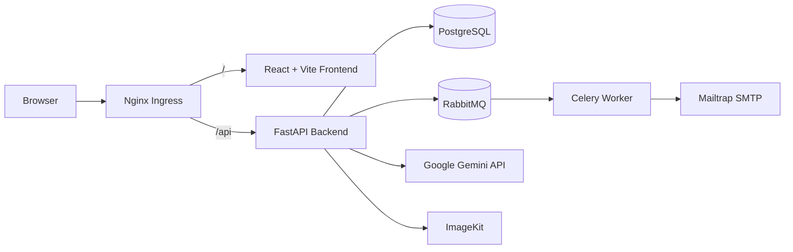

# Challenge App

A full-stack challenge application built with a FastAPI backend, a React + Vite frontend, PostgreSQL for persistence, and Celery + RabbitMQ for asynchronous background work.

The application allows authenticated users to generate quiz-style challenges, track quota usage, upload a profile image, and view their challenge history. It uses JWT-based authentication stored in an HttpOnly cookie, integrates with Google Gemini to generate challenge content, and sends a challenge creation notification email through Mailtrap.

## Table of Contents

* [Features](#features)
* [Architecture Overview](#architecture-overview)
* [Technology Stack](#technology-stack)
* [Project Structure](#project-structure)
* [How the Application Works](#how-the-application-works)
* [Local Development](#local-development)
* [Environment Variables](#environment-variables)
* [Testing](#testing)
* [Docker](#docker)
* [CI Pipeline](#ci-pipeline)
* [CD / Kubernetes](#cd--kubernetes)
* [Minikube Local Kubernetes Deployment](#minikube-local-kubernetes-deployment)
* [Jenkins CD](#jenkins-cd)
* [Security](#security)
* [Troubleshooting](#troubleshooting)
* [Future Improvements](#future-improvements)

## Features

* User registration and login with JWT stored in an HttpOnly cookie
* Authenticated user profile, quota, username, and profile image routes
* Challenge generation using Google Gemini
* Per-user challenge quota and reset logic
* Challenge history and deletion
* Async database access with SQLAlchemy and PostgreSQL
* Background email notification using Celery and RabbitMQ
* Profile image upload through ImageKit
* Dockerized backend, frontend, and local infrastructure services
* Jenkins-based CI/CD with Docker image build and push
* Kubernetes manifests for the backend, frontend, PostgreSQL, RabbitMQ, Celery worker, migration Job, and Ingress

## Architecture Overview

The application consists of a React frontend and a FastAPI backend. In the Kubernetes deployment, Nginx Ingress provides the external entry point and routes requests by path.



### Components

* **Frontend:** React application served with Vite and uses Axios to call the backend API with cookies enabled.
* **Backend:** FastAPI application with user and challenge routes, JWT authentication, database access, and integrations with Gemini, ImageKit, and Mailtrap.
* **PostgreSQL:** Main relational database used by the backend.
* **RabbitMQ:** Message broker used by Celery for background task processing.
* **Celery Worker:** Consumes background tasks from RabbitMQ, including the challenge creation email notification.
* **Google Gemini:** Generates challenge content.
* **ImageKit:** Handles profile image uploads.
* **Mailtrap:** Provides SMTP email delivery for the application's notification email.
* **Kubernetes Ingress:** Routes `/api` requests to the backend service and `/` requests to the frontend service.

## Technology Stack

### Backend

* Python 3.13
* FastAPI
* SQLAlchemy Async
* Alembic
* Pydantic Settings
* JWT authentication via PyJWT
* Password hashing via `pwdlib[argon2]`
* Async PostgreSQL driver: `asyncpg`

### Frontend

* React 19
* Vite 8
* Axios
* Lucide React
* Tailwind CSS

### Database

* PostgreSQL 16

### Background Processing

* Celery 5.6.3
* RabbitMQ 4.2-management

### DevOps / CI-CD

* Jenkins
* Docker
* Kubernetes
* Minikube for local Kubernetes development and testing
* Kubernetes manifests under `K8s/`

### Infrastructure

* Backend and frontend Dockerfiles
* Kubernetes ConfigMap
* Kubernetes Secret
* Deployments
* Services
* StatefulSets
* PersistentVolumeClaims
* Ingress
* Migration Job
* Jenkins pipelines
* Jenkins kubeconfig credential

### Testing

* pytest
* pytest-asyncio
* pytest-cov
* pytest-mock

### Security / Code Quality

* Gitleaks for secret scanning
* Trivy for filesystem and container image scanning
* SonarQube for static analysis and quality gate enforcement

## Project Structure

```text
Challenge-app/

├── README.md
├── Jenkinsfile-CI
├── Jenkinsfile-CD
├── K8s/
│   ├── backend/
│   │   ├── deployment.yml
│   │   └── service.yml
│   ├── celery-worker/
│   │   └── deployment.yml
│   ├── frontend/
│   │   ├── deployment.yml
│   │   └── service.yml
│   ├── migrate/
│   │   └── job.yml
│   ├── postgres/
│   │   ├── pvc.yml
│   │   ├── service.yml
│   │   └── statefulset.yml
│   ├── rabbitmq/
│   │   ├── pvc.yml
│   │   ├── service.yml
│   │   └── statefulset.yml
│   ├── configmap.yml
│   └── ingress.yml
├── backend/
│   ├── .env.example
│   ├── Dockerfile
│   ├── docker-compose.yml
│   ├── pyproject.toml
│   ├── alembic/
│   │   ├── README
│   │   ├── env.py
│   │   └── versions/
│   ├── src/
│   │   ├── __init__.py
│   │   ├── main.py
│   │   ├── auth/
│   │   ├── celery/
│   │   ├── core/
│   │   ├── database/
│   │   ├── models/
│   │   ├── routes/
│   │   ├── schemas/
│   │   ├── services/
│   │   ├── tests/
│   │   └── utils/
│   └── tools/
│       └── docker-compose.yml
├── frontend/
│   ├── Dockerfile
│   ├── package.json
│   ├── vite.config.js
│   ├── index.html
│   ├── public/
│   └── src/
└── .gitignore
```

## How the Application Works

### Authentication Flow

1. A user registers with a username, email, and password.
2. The backend hashes the password and stores the user in PostgreSQL.
3. On login, the server validates the credentials and creates a JWT containing the user ID in the `sub` claim.
4. The JWT is stored in an HttpOnly cookie named `access_token`.
5. Protected routes read the cookie through `get_current_user` in `backend/src/auth/auth.py`.
6. Unauthorized requests are rejected with HTTP 401.

### Challenge Creation Flow

1. The frontend sends `POST /api/challenges/create`.
2. The backend checks the current user's remaining quota.
3. If quota is available, the backend calls `generate_challenge()`.
4. The Google Gemini client generates the challenge content.
5. The generated challenge is stored in PostgreSQL with its associated user ID, answer, and explanation.
6. The user's `quota_remaining` value is decremented by 1.
7. The backend queues a Celery task to send a challenge creation notification email.

### Background Task Flow

1. The Celery application is defined in `backend/src/celery/celery.py`.
2. The task is registered in `backend/src/celery/task.py`.
3. The task sends a Mailtrap email with the subject `Challenge App` and the body `Challenge created successfully`.
4. RabbitMQ acts as the message broker.
5. The Celery worker consumes and executes the task asynchronously.

### Image Upload Flow

1. A user uploads a profile image using `POST /api/users/profile/image`.
2. The backend reads the uploaded file.
3. The file is uploaded to ImageKit.
4. The returned URL is stored in the `users.image_url` field.
5. The profile image can be retrieved through `GET /api/users/get-image`.

### Database Interaction

* The backend uses async SQLAlchemy sessions created in `backend/src/database/db.py`.
* Alembic is configured in `backend/alembic/env.py`.
* Database migrations use the configured `DATABASE_URL`.
* Database models are defined in `backend/src/models/model.py` and include the `User` and `Challenge` tables.

### External API Usage

* **Google Gemini:** Used to generate challenge content through `GOOGLE_API_KEY`.
* **ImageKit:** Used for profile image uploads through `IMAGEKIT_PRIVATE_KEY`.
* **Mailtrap:** Used by the Celery worker for SMTP email delivery through the `MAILTRAP_*` configuration.

## Local Development

### Prerequisites

* Git
* Docker and Docker Compose
* Python 3.13
* `uv`
* Node.js 22

### 1. Clone the Repository

```bash
git clone https://github.com/OMAR300927/Challenge-app.git
cd Challenge-app
```

### 2. Backend Setup

From the project root:

```bash
cd backend
cp .env.example .env
```

Fill in the required values in `.env` using the variable descriptions in the [Environment Variables](#environment-variables) section.

Install dependencies:

```bash
uv sync --frozen
```

Run the backend locally:

```bash
uv run uvicorn src.main:app --host 0.0.0.0 --port 8000
```

The FastAPI application mounts the user and challenge routers under the API prefix configured by `API_PREFIX`.

### 3. Frontend Setup

From the project root:

```bash
cd frontend
npm install
npm run dev
```

The Vite development configuration proxies `/api` requests to:

```text
http://localhost:8000
```

This allows the frontend to use the same `/api` path locally that is used through Kubernetes Ingress.

### 4. Start PostgreSQL and RabbitMQ

The local Docker Compose file at `backend/docker-compose.yml` includes PostgreSQL and RabbitMQ.

To start only those infrastructure services:

```bash
cd backend
docker compose up -d postgres rabbitmq
```

### 5. Run Alembic Migrations

From the backend directory:

```bash
cd backend
uv run alembic upgrade head
```

The same migration command is executed by the Kubernetes migration Job.

### 6. Run Celery Locally

From the backend directory:

```bash
cd backend
uv run celery -A src.celery.celery:celery_app worker --loglevel=info --pool=solo
```

This matches the worker command used in `K8s/celery-worker/deployment.yml`.

### 7. Run the Full Local Stack with Docker Compose

From `backend/`:

```bash
cd backend
docker compose up --build
```

The local Compose stack includes:

* PostgreSQL
* RabbitMQ
* Backend
* Celery worker
* Frontend

## Environment Variables

The backend environment configuration is defined in `backend/.env.example` and loaded by `backend/src/core/config.py` using `pydantic-settings`.

### Required Variables

| Variable               | Required        | Purpose                                           |
| ---------------------- | --------------- | ------------------------------------------------- |
| `SECRET_KEY`           | Yes             | JWT signing key                                   |
| `DATABASE_URL`         | Yes             | PostgreSQL connection URL used by the application |
| `TEST_DATABASE_URL`    | Yes for testing | PostgreSQL connection URL used by the test suite  |
| `ALLOW_ORIGINS`        | Yes             | FastAPI CORS allowlist                            |
| `API_PREFIX`           | Yes             | Prefix applied to backend routers                 |
| `GOOGLE_API_KEY`       | Yes             | Google Gemini API key                             |
| `IMAGEKIT_PRIVATE_KEY` | Yes             | Private ImageKit key                              |
| `RABBITMQ_USER`        | Yes             | RabbitMQ username                                 |
| `RABBITMQ_PASS`        | Yes             | RabbitMQ password                                 |
| `BROKER_URL`           | Yes             | Celery broker connection URL                      |
| `MAILTRAP_HOST`        | Yes             | Mailtrap SMTP host                                |
| `MAILTRAP_PORT`        | Yes             | Mailtrap SMTP port                                |
| `MAILTRAP_USERNAME`    | Yes             | Mailtrap username                                 |
| `MAILTRAP_PASSWORD`    | Yes             | Mailtrap password                                 |
| `MAILTRAP_FROM_EMAIL`  | Yes             | Sender email address                              |
| `MAILTRAP_FROM_NAME`   | Yes             | Sender display name                               |
| `MAILTRAP_TO_EMAIL`    | Yes             | Recipient email address                           |
| `POSTGRES_DB`          | Yes             | PostgreSQL database name                          |
| `POSTGRES_USER`        | Yes             | PostgreSQL username                               |
| `POSTGRES_PASS`        | Yes             | PostgreSQL password                               |
| `POSTGRES_TEST_DB`     | Yes for testing | PostgreSQL test database name                     |

### Sensitive Variables

The following values contain credentials or secrets and must never be committed to GitHub:

* `SECRET_KEY`
* `GOOGLE_API_KEY`
* `IMAGEKIT_PRIVATE_KEY`
* `RABBITMQ_PASS`
* `MAILTRAP_USERNAME`
* `MAILTRAP_PASSWORD`
* `POSTGRES_PASS`

### Local vs CI Testing Variables

* `DATABASE_URL` and `BROKER_URL` are used during normal application runtime.
* `TEST_DATABASE_URL` and `POSTGRES_TEST_DB` are used by the pytest fixtures in `backend/src/tests/conftest.py`.
* The Jenkins CI pipeline provides the required environment values before running the test suite and removes the temporary environment file afterward.

## Testing

The backend test suite is located under `backend/src/tests/` and uses asynchronous pytest fixtures.

Run the tests:

```bash
cd backend
uv sync --frozen
uv run pytest src/tests/
```

Run coverage:

```bash
cd backend
uv run coverage erase
uv run coverage run -m pytest src/tests/
uv run coverage xml -o coverage.xml
```

The CI pipeline uses the same testing and coverage approach.

## Docker

### Backend Image

The backend image is built from `backend/Dockerfile`.

Build it with:

```bash
cd backend
docker build -t omarsa999/challenge-backend:latest .
```

### Frontend Image

The frontend image is built from `frontend/Dockerfile`.

Build it with:

```bash
cd frontend
docker build -t omarsa999/challenge-frontend:latest .
```

### Docker Compose Files

The repository contains two relevant Compose files:

* `backend/docker-compose.yml`: Local application stack containing PostgreSQL, RabbitMQ, backend, Celery worker, and frontend.
* `backend/tools/docker-compose.yml`: Jenkins, SonarQube, and PostgreSQL test-database helper services used by the CI environment.

Run the local application stack with:

```bash
cd backend
docker compose up --build
```

## CI Pipeline

The repository contains the Jenkins CI pipeline in `Jenkinsfile-CI`.

The pipeline stages are:

1. Checkout
2. Gitleaks scan
3. Pytest
4. Coverage
5. Trivy filesystem scan
6. SonarQube analysis
7. SonarQube quality gate
8. Backend and frontend image build and tagging
9. Trivy image scans
10. Docker Hub image push

Representative commands used by the pipeline include:

```bash
gitleaks detect --source . --exit-code 1

uv sync --frozen

uv run coverage erase
uv run coverage run -m pytest src/tests/
uv run coverage xml -o coverage.xml

trivy fs . --format table -o fs-report.txt

trivy image --timeout 10m --format table \
  -o backend-image-report.txt \
  $USERNAME/challenge-backend:latest

trivy image --timeout 10m --format table \
  -o frontend-image-report.txt \
  $USERNAME/challenge-frontend:latest
```

SonarQube is configured through:

```groovy
withSonarQubeEnv('sonar-server')
```

The generated `backend/coverage.xml` file is provided to SonarQube for coverage analysis.

## CD / Kubernetes

The Kubernetes manifests are located under `K8s/`.

### Directory Breakdown

* `K8s/configmap.yml`: Non-secret application configuration
* `K8s/postgres/`: PostgreSQL StatefulSet, Service, and PVC
* `K8s/rabbitmq/`: RabbitMQ StatefulSet, Service, and PVC
* `K8s/backend/`: Backend Deployment and Service
* `K8s/celery-worker/`: Celery worker Deployment
* `K8s/frontend/`: Frontend Deployment and Service
* `K8s/migrate/job.yml`: Database migration Job
* `K8s/ingress.yml`: Nginx Ingress routing rules

### ConfigMap

`K8s/configmap.yml` contains non-sensitive configuration such as:

* `ALLOW_ORIGINS`
* `API_PREFIX`
* RabbitMQ username
* Mailtrap host and SMTP port
* Mailtrap sender and recipient configuration
* PostgreSQL database and username

Actual credentials are stored in the Kubernetes Secret and are not included in the ConfigMap.

### PostgreSQL

`K8s/postgres/statefulset.yml` defines the PostgreSQL StatefulSet with:

* Image: `postgres:16-alpine`
* Service name: `postgres`
* PVC: `postgres-pvc`
* Readiness and liveness probes using `pg_isready`
* CPU request: `100m`
* Memory request: `256Mi`
* CPU limit: `500m`
* Memory limit: `512Mi`

The PostgreSQL Service uses ClusterIP on port 5432, and the PVC requests 2 GiB of storage.

### RabbitMQ

`K8s/rabbitmq/statefulset.yml` defines a single-node RabbitMQ StatefulSet with:

* Image: `rabbitmq:4.2-management`
* AMQP port: `5672`
* Management UI port: `15672`
* Credentials loaded from the `challenge-app-secret` Secret
* PVC: `rabbitmq-pvc`
* Readiness and liveness checks using `rabbitmq-diagnostics -q ping`
* CPU request: `100m`
* Memory request: `256Mi`
* CPU limit: `500m`
* Memory limit: `512Mi`

### Backend

`K8s/backend/deployment.yml` defines the `challenge-backend` Deployment with:

* Image: `omarsa999/challenge-backend:latest`
* Container port: `8000`
* `DATABASE_URL` constructed from the PostgreSQL environment values
* `BROKER_URL` constructed from the RabbitMQ environment values
* Secret-backed values for application and service credentials
* ConfigMap-backed values for non-sensitive configuration
* CPU request: `100m`
* Memory request: `128Mi`
* CPU limit: `500m`
* Memory limit: `512Mi`

The backend Service uses ClusterIP and exposes port 8000.

### Celery Worker

`K8s/celery-worker/deployment.yml` defines a single Celery worker using:

```bash
uv run celery -A src.celery.celery:celery_app worker --loglevel=info --pool=solo
```

The worker receives the environment values required by the application and connects to RabbitMQ and PostgreSQL.

### Frontend

`K8s/frontend/deployment.yml` defines the React frontend Deployment with:

* Image: `omarsa999/challenge-frontend:latest`
* Container port: `5173`
* `__VITE_ADDITIONAL_SERVER_ALLOWED_HOSTS=challenge-app.com`
* CPU request: `100m`
* Memory request: `128Mi`
* CPU limit: `500m`
* Memory limit: `512Mi`

The frontend Service uses ClusterIP and exposes port 5173.

The frontend communicates with the backend using the `/api` path.

### Migration Job

`K8s/migrate/job.yml` defines the database migration Job named `challenge-migrate`.

The Jenkins CD pipeline runs this Job after PostgreSQL and RabbitMQ are ready and before applying the application workloads.

The Job:

* Waits for PostgreSQL readiness using an init container
* Runs `uv run alembic upgrade head`
* Retries up to 6 times
* Uses an active deadline of 300 seconds
* Receives required configuration from the ConfigMap and Secret

### Ingress

`K8s/ingress.yml` defines an Nginx Ingress with:

* Host: `challenge-app.com`
* `/api` routed to the backend Service on port 8000
* `/` routed to the frontend Service on port 5173
* `nginx.ingress.kubernetes.io/proxy-body-size: "10m"`

The 10 MiB request body limit allows profile image uploads through the Ingress.

### Kubernetes Secret Creation

The Secret is intentionally created manually with `kubectl` and is not stored as a manifest in Git.

Create the Secret before deploying workloads:

```bash
kubectl create secret generic challenge-app-secret \
  --from-literal=SECRET_KEY="your_secret_key" \
  --from-literal=GOOGLE_API_KEY="your_google_api_key" \
  --from-literal=IMAGEKIT_PRIVATE_KEY="your_imagekit_private_key" \
  --from-literal=RABBITMQ_PASS="your_rabbitmq_password" \
  --from-literal=MAILTRAP_USERNAME="your_mailtrap_username" \
  --from-literal=MAILTRAP_PASSWORD="your_mailtrap_password" \
  --from-literal=POSTGRES_PASS="your_postgres_password"
```

Replace every placeholder with the corresponding value for your own environment.

The Secret is intentionally kept outside Git. Real credentials must never be committed to GitHub.

## Minikube Local Kubernetes Deployment

Minikube is used as the local Kubernetes cluster for development and testing.

### 1. Start Minikube

Start a local Minikube cluster using the Docker driver:

```bash
minikube start --driver=docker
```

### 2. Enable the Ingress Controller

```bash
minikube addons enable ingress
```

Verify the controller:

```bash
kubectl get pods -n ingress-nginx
```

The Ingress controller should eventually show a `Running` status.

### 3. Create the Kubernetes Secret

Create `challenge-app-secret` using the command from the [Kubernetes Secret Creation](#kubernetes-secret-creation) section.

### 4. Apply the Kubernetes Resources

From the repository root:

```bash
kubectl cluster-info

kubectl apply -f K8s/configmap.yml

kubectl apply -R -f K8s/postgres/
kubectl apply -R -f K8s/rabbitmq/

kubectl rollout status statefulset/postgres --timeout=180s
kubectl rollout status statefulset/rabbitmq --timeout=180s

kubectl delete job challenge-migrate --ignore-not-found=true
kubectl apply -f K8s/migrate/job.yml
kubectl wait --for=condition=complete job/challenge-migrate --timeout=300s

kubectl apply -R -f K8s/backend/
kubectl apply -R -f K8s/celery-worker/
kubectl apply -R -f K8s/frontend/

kubectl apply -f K8s/ingress.yml
```

### 5. Verify the Deployment

```bash
kubectl rollout status deployment/challenge-backend --timeout=180s
kubectl rollout status deployment/challenge-celery-worker --timeout=180s
kubectl rollout status deployment/challenge-frontend --timeout=180s

kubectl get pods
kubectl get services
kubectl get ingress
```

### Local Hostname Access

The Ingress is configured to use:

```text
challenge-app.com
```

For local Minikube access, get the Minikube IP:

```bash
minikube ip
```

Then add the following entry to `/etc/hosts`:

```text
<MINIKUBE_IP> challenge-app.com
```

For example:

```text
192.168.49.2 challenge-app.com
```

The Minikube IP may change if the Minikube cluster is deleted and recreated. In that case, update the `/etc/hosts` entry accordingly.

## Jenkins CD

`Jenkinsfile-CD` is the repository's Kubernetes deployment pipeline.

The pipeline contains three stages:

1. Checkout
2. Deploy Kubernetes
3. Verify Kubernetes

### Jenkins Kubeconfig

Jenkins accesses the Kubernetes cluster using a kubeconfig stored as a Jenkins **Secret File** credential.

The credential ID used by the pipeline is:

```text
kubeconfig
```

The pipeline loads the credential and sets the `KUBECONFIG` environment variable for the `kubectl` commands.

The kubeconfig contents are not stored in the repository.

### Deploy Kubernetes Stage

The deployment stage:

* Checks out the `main` branch
* Loads the `kubeconfig` Jenkins credential
* Runs `kubectl cluster-info`
* Applies `K8s/configmap.yml`
* Applies the PostgreSQL and RabbitMQ resources
* Waits for PostgreSQL and RabbitMQ StatefulSets to become ready
* Deletes any previous `challenge-migrate` Job
* Applies the migration Job
* Waits for the migration Job to complete successfully
* Applies the backend resources
* Applies the Celery worker resources
* Applies the frontend resources
* Applies the Ingress

### Verify Kubernetes Stage

The verification stage checks:

* Backend rollout
* Celery worker rollout
* Frontend rollout
* Pod status
* Service status
* Ingress status

## Security

* Real secrets must never be committed to GitHub.
* Kubernetes credentials are stored outside the repository.
* The Kubernetes Secret is created manually and is not stored as a manifest in Git.
* Gitleaks scans the repository for exposed secrets during CI.
* Trivy scans the filesystem and container images.
* SonarQube performs static analysis and enforces the configured quality gate.
* Authentication uses an HttpOnly JWT cookie named `access_token`.

## Troubleshooting

### CrashLoopBackOff

Check pod status and logs:

```bash
kubectl get pods
kubectl describe pod <pod-name>
kubectl logs <pod-name>
```

Check for application startup errors, database connection failures, invalid environment variables, or other configuration problems.

### OOMKilled

Inspect the pod:

```bash
kubectl describe pod <pod-name>
kubectl top pod
```

Review the memory requests and limits in the Kubernetes manifest and adjust them when necessary.

### ImagePullBackOff

Check the pod and cluster events:

```bash
kubectl get pods
kubectl describe pod <pod-name>
kubectl get events --sort-by=.metadata.creationTimestamp
```

Verify that the image name and tag exist and that the cluster can reach the container registry.

### Database Connection Failures

Check PostgreSQL:

```bash
kubectl get statefulset postgres
kubectl logs statefulset/postgres
kubectl get svc postgres
```

Verify that:

* `POSTGRES_PASS`, `POSTGRES_DB`, and `POSTGRES_USER` are correct.
* The backend and migration Job use the PostgreSQL Service name `postgres`.
* PostgreSQL is ready before the application attempts to connect.

### Alembic Migration Failures

Check the migration Job:

```bash
kubectl get job challenge-migrate
kubectl describe job challenge-migrate
kubectl logs job/challenge-migrate
```

The migration Job is the main place to inspect database schema or Alembic configuration errors.

### RabbitMQ / Celery Failures

Check RabbitMQ and the Celery worker:

```bash
kubectl get pods | grep rabbitmq
kubectl get svc rabbitmq
kubectl logs deployment/challenge-celery-worker
kubectl logs statefulset/rabbitmq
```

Verify that RabbitMQ is running and that `BROKER_URL` uses the correct credentials and RabbitMQ Service name.

### Frontend / Backend Connectivity Problems

Check the Ingress and backend:

```bash
kubectl get ingress
kubectl describe ingress challenge-app-ingress
kubectl logs deployment/challenge-backend
```

The frontend uses `/api` for backend requests, and the Ingress routes `/api` to the backend Service.

### Ingress Problems

Check the Ingress:

```bash
kubectl get ingress
kubectl describe ingress challenge-app-ingress
kubectl get svc
```

Also verify that the Minikube Ingress controller is running:

```bash
kubectl get pods -n ingress-nginx
```

Confirm that the host is configured correctly:

```text
challenge-app.com
```

### ConfigMap / Secret Problems

Inspect the ConfigMap and Secret:

```bash
kubectl get configmap challenge-app-config -o yaml
kubectl get secret challenge-app-secret -o yaml
```

Verify that the Secret exists before starting workloads and that the required non-secret configuration exists in the ConfigMap.

## Future Improvements

The following improvements are not currently implemented:

* Replace `latest` image tags with immutable Git SHA-based image tags.
* Replace the Vite development server in Kubernetes with a production frontend build served by Nginx.
* Add backend health, readiness, and liveness endpoints and corresponding Kubernetes probes.
* Split application settings into separate configuration domains as the project grows.
* Add stricter Trivy failure policies for high and critical vulnerabilities.
* Add more integration and end-to-end tests.
* Add environment-specific Kubernetes configuration for development, staging, and production.
* Add automated rollback or deployment promotion steps in Jenkins.

## Notes

This repository contains a working full-stack application with local Docker Compose support, automated testing, Jenkins CI/CD pipelines, and Kubernetes deployment manifests.

The README is intended to document the application's current architecture, development workflow, CI/CD process, and local Kubernetes deployment without exposing real credentials or secret values.
